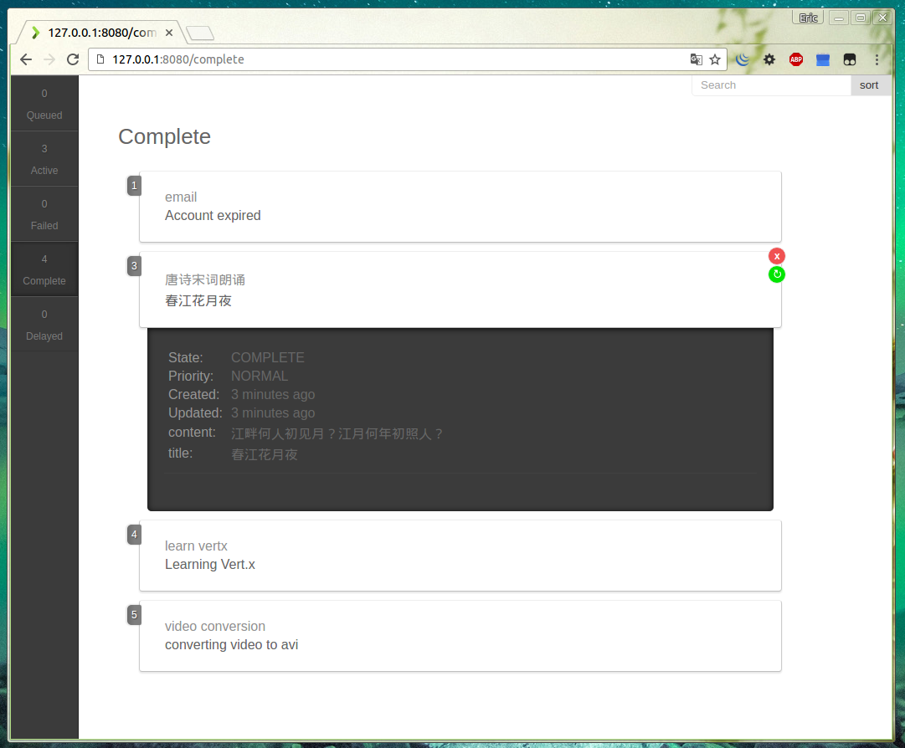

# Vert.x Kue

Vert.x Blueprint Application - **Vert.x Kue** is a priority job queue developed with Vert.x and backed by *Redis*. 
It's a Vert.x implementation version of [Node.js Kue](https://github.com/Automattic/kue).

## Introduction

TODO

## Detailed Document

- [English Version](docs/en/doc-en.md)
- [中文文档](docs/zh-cn/doc-zh-cn.md)

## Build/Run

To build the code:

    gradle build

Vert.x Kue requires Redis running:

    redis-server

Then we can run the example:

    java -jar kue-core/build/libs/vertx-blueprint-kue-core.jar -cluster -ha -conf config/config.json
    java -jar kue-http/build/libs/vertx-blueprint-kue-http.jar -cluster -ha -conf config/config.json
    java -jar kue-example/build/libs/vertx-blueprint-kue-example.jar -cluster -ha -conf config/config.json

Then you can visit `http://localhost:8080` to inspect the queue via Kue UI in the browser.

