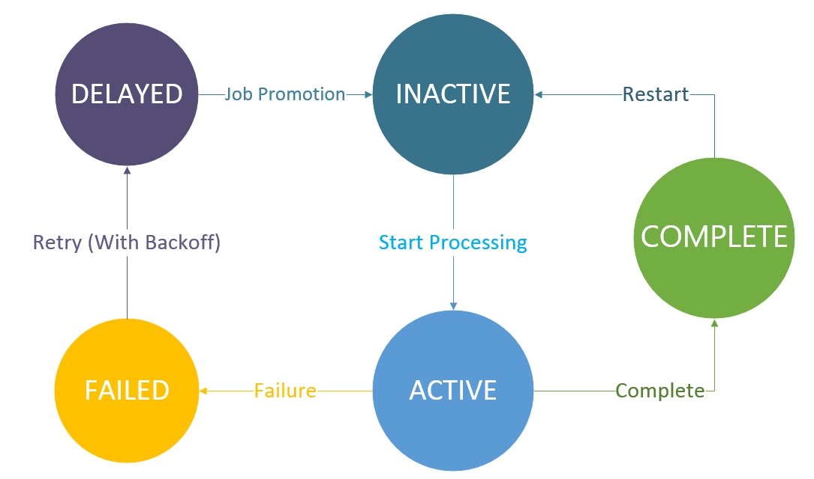
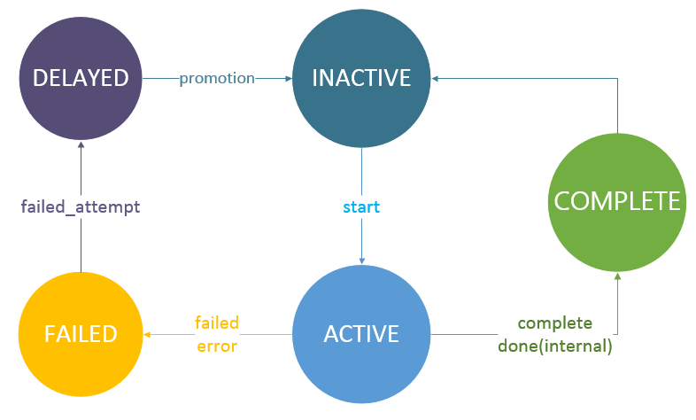
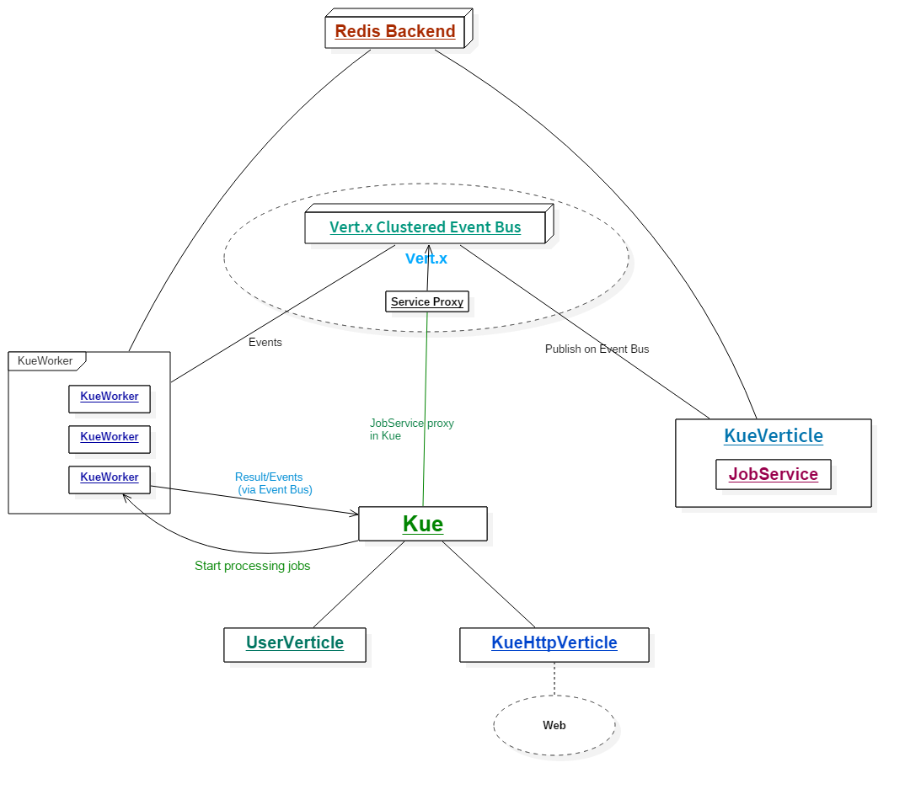

# Vert.x 蓝图 | Vert.x Kue 教程（Core部分）

## 目录

- [前言](#前言)
- [Vert.x的消息系统](#)
- [Vert.x Kue 架构设计](#)
- [项目结构](#)
- [任务实体 - 不仅仅是一个数据对象](#)
- [Event Bus 服务 - JobService](#)
- [Kue - 工作队列](#)
- [KueWorker - 任务在此处理](#)
- [CallbackKue - 提供多语言支持](#)
- [展示时间！](#)
- [完成我们的旅程！](#)

## 前言

欢迎回到Vert.x 蓝图系列～在本教程中，我们将利用Vert.x开发一个基于消息的应用 - Vert.x Kue，它是一个使用Vert.x开发的优先级工作队列，数据存储使用的是 *Redis*。Vert.x Kue是[Automattic/kue](https://github.com/Automattic/kue)的Vert.x实现版本。我们可以使用Vert.x Kue来处理各种各样的任务，比如文件转换、订单处理等等。

通过本教程，你将会学习到以下内容：

- 消息、消息系统以及事件驱动的运用
- Vert.x **Event Bus** 的几种事件机制（发布/订阅、点对点模式）
- 设计 **分布式** 的Vert.x应用
- 工作队列的设计
- **Vert.x Service Proxy**（服务代理）的运用
- 更深层次的Redis运用

本教程是**Vert.x 蓝图系列**的第二篇教程，对应的Vert.x版本为**3.3.0**。本教程中的完整代码已托管至[GitHub](https://github.com/sczyh30/vertx-blueprint-job-queue/tree/master)。

## Vert.x的消息系统

既然我们要用Vert.x开发一个基于消息的应用，那么我们先来瞅一瞅Vert.x的消息系统吧～在Vert.x中，我们可以通过 **Event Bus** 来发送和接收各种各样的消息，这些消息可以来自不同的`Vertx`实例。怎么样，很酷吧？我们都将消息发送至Event Bus上的某个**地址**上，这个地址可以是任意的字符串。

Event Bus支持三种消息机制：**发布/订阅**(Publish/Subscribe)、**点对点**(Point to point)以及**请求/回应**(Request-Response)模式。下面我们就来看一看这几种机制。

### 发布/订阅模式

在**发布/订阅模式**中，消息被发布到Event Bus的某一个地址上，所有订阅此地址的`Handler`都会接收到该消息并且调用相应的处理逻辑。我们来看一看示例代码：

```java
EventBus eventBus = vertx.eventBus();

eventBus.consumer("foo.bar.baz", r -> { // subscribe to `foo.bar.baz` address
  System.out.println("1: " + r.body());
});
eventBus.consumer("foo.bar.baz", r -> { // subscribe to `foo.bar.baz` address
  System.out.println("2: " + r.body());
});

eventBus.publish("foo.bar.baz", "+1s"); // 向此地址发送消息
```

我们可以通过`vertx.eventBus()`方法获取`EventBus`的引用，然后我们就可以通过`consume`方法订阅某个地址的消息并且绑定一个`Handler`。接着我们通过`publish`向此地址发送消息。如果运行上面的例子，我们会得到一下结果：

```
2: +1s
1: +1s
```

### 点对点模式

如果我们把上面的示例中的`publish`方法替代成`send`方法，上面的实例就变成**点对点模式**了。在点对点模式中，消息被发布到Event Bus的某一个地址上。Vert.x会将此消息传递给其中监听此地址的`Handler`之一。如果有多个`Handler`绑定到此地址，那么就使用轮询算法随机挑一个`Handler`传递消息。比如在此示例中，程序只会打印`2: +1s`或者`1: +1s`之中的一个。

### 请求/回应模式

当我们绑定的`Handler`接收到消息的时候，我们可不可以给消息的发送者回复呢？当然了！当我们通过`send`方法发送消息的时候，我们可以同时指定一个回复处理函数(reply handler)。然后当某个消息的订阅者接收到消息的时候，它就可以给发送者回复消息；如果发送者接收到了回复，发送者绑定的回复处理函数就会被调用。这就是**请求/回应模式**。

好啦，现在我们已经粗略了解了Vert.x中的消息系统 - Event Bus的基本使用，下面我们就看看Vert.x Kue的基本设计。有关更多关于Event Bus的信息请参考[Vert.x Core Manual - Event Bus](http://vertx.io/docs/vertx-core/java/#event_bus)。

## Vert.x Kue 架构设计

### Vert.x Kue 组件划分

在我们的项目中，我们将Vert.x Kue划分为两个模块：

- `kue-core`: 核心组件，提供优先级队列的功能
- `kue-http`: Web组件，提供Web UI以及REST API

另外我们还提供一个示例模块`kue-example`用于演示以及阐述如何使用Vert.x Kue。

既然我们的项目有两个模块，那么你一定会好奇：两个模块之间是如何进行通信的？并且如果我们写自己的Kue应用的话，我们该怎样去调用Kue Core中的服务呢？不要着急，谜底将在后边的章节中揭晓:-)

### Vert.x Kue 核心模块

回顾一下Vert.x Kue的作用 - 优先级工作队列，所以在Vert.x Kue的核心模块中我们设计了以下的类：

- `Job` - 任务（作业）数据实体
- `JobService` - 异步服务接口，提供操作任务以及获取数据的相关逻辑
- `KueWorker` - 用于处理任务的Verticle
- `Kue` - 工作队列

前边我们提到过，我们的两个组件之间需要一种通信机制可以互相通信 - 这里我们使用Vert.x的**集群模式**，即以clustered的模式来部署Verticle。这样的环境下的Event Bus同样也是集群模式的，因此各个组件可以通过集群模式下的Event Bus进行通信。很不错吧？在Vert.x的集群模式下，我们需要指定一个集群管理器`ClusterManager`。这里我们使用默认的`HazelcastClusterManager`，使用**Hazelcast**作为集群管理。

在Vert.x Kue中，我们将`JobService`服务发布至分布式的Event Bus上，这样其它的组件就可以通过Event Bus调用该服务了。我们设计了一个`KueVerticle`用于注册服务。Vert.x提供了Vert.x Service Proxy（服务代理组件），可以很方便地将服务注册至Event Bus上，然后在其它地方获取此服务的代理并调用。我们将在下面的章节中详细介绍**Vert.x Service Proxy**。

### 基于Future的异步模式

在我们的Vert.x Kue中，大多数的异步方法都是基于`Future`的。如果您看过蓝图系列的第一篇文章的话，您一定不会对这种模式很陌生。在Vert.x 3.3.0中，我们的`Future`支持基本的响应式的操作，比如`map`和`compose`。它们用起来非常方便，因为我们可以将多个`Future`以响应式的方式组合起来而不用担心陷入回调地狱中。

### Vert.x Kue中的事件

正如我们在[Vert.x Kue 特性介绍](vertx-kue-features.zh-cn.md)中提到的那样，Vert.x Kue支持两种级别的事件：**任务事件(job events)** 以及 **队列事件(queue events)**。在Vert.x Kue中，我们设计了三种事件地址：

- `vertx.kue.handler.job.{handlerType}.{addressId}.{jobType}`: 某个特定任务的任务事件地址
- `vertx.kue.handler.workers.{eventType}`: （全局）队列事件地址
- `vertx.kue.handler.workers.{eventType}.{addressId}`: 某个特定任务的内部事件地址

在[特性介绍文档](vertx-kue-features.zh-cn.md)中，我们提到了以下几种任务事件：

- `start` 开始处理一个任务 (`onStart`)
- `promotion` 一个延期的任务时间已到，提升至工作队列中 (`onPromotion`)
- `progress` 任务的进度变化 (`onProgress`)
- `failed_attempt` 任务处理失败，但是还可以重试 (`onFailureAttempt`)
- `failed` 任务处理失败并且不能重试 (`onFailure`)
- `complete` 任务完成 (`onComplete`)
- `remove` 任务从后端存储中移除 (`onRemove`)

队列事件也相似，只不过需要加前缀`job_`。这些事件都会通过`send`方法发送至Event Bus上。每一个任务都有对应的任务事件地址，因此它们能够正确地接收到对应的事件并进行相应的处理逻辑。

特别地，我们还有两个内部事件：`done`和`done_fail`。`done`事件对应一个任务在底层的处理已经完成，而`done_fail`事件对应一个任务在底层的处理失败。这两个事件使用第三种地址进行传递。

### 任务状态

在Vert.x中，任务共有五种状态：

- `INACTIVE`: 任务还未开始处理，在工作队列中等待处理
- `ACTIVE`: 任务正在处理中
- `COMPLETE`: 任务处理完成
- `FAILED`: 任务处理失败
- `DELAYED`: 任务延时处理，正在等待计时器时间到并提升至工作队列中

我们使用状态图来描述任务状态的变化：



以及任务状态的变化伴随的事件：



### 整体设计

为了让大家对Vert.x Kue的架构有大致的了解，我用一幅图来简略描述整个Vert.x Kue的设计：



现在我们对Vert.x Kue的设计有了大致的了解了，下面我们就来看一看Vert.x Kue的代码实现了～

## 项目结构

## 任务实体 - 不仅仅是一个数据对象

## Event Bus 服务 - JobService

## Kue - 工作队列

## KueWorker - 任务在此处理

## CallbackKue - 提供多语言支持

## 展示时间！

## 完成我们的旅程！
